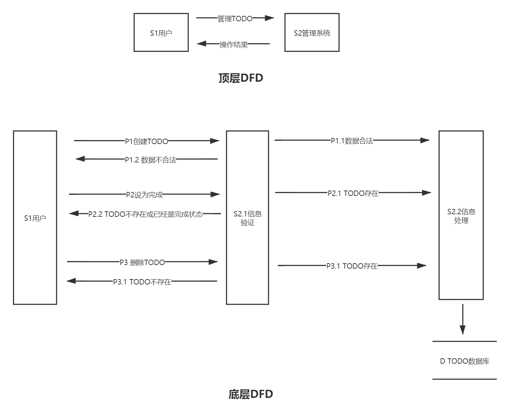

## 项目背景
在生活和工作中，我们每天都要处理很多的事情，一些重要程度高的事情我们可能不会忘记去做，但琐碎的小事一旦多了，就很容易遗漏或是想不起来，所以我们需要一个辅助工具来帮助管理这些琐事，这样我们就可以聚焦于当前事情，不用再时刻想着我还有什么什么没做。TODO APP 则是一个最佳之选，用它来记录我们要做的大事小事，完成后则将其设为完成，不再做则将其删除。

## 竞品分析

TODO类应用有很多，完全轻量版的很少，该项目只专注于主功能的实现，不含有任何附加性功能，具有很强的目的性，轻量简洁。  

|名称|功能 |
|---|---|
|[todolist](https://todoist.com/)| 丰富|
|[microsoft todo](https://todo.microsoft.com/tasks/)| 丰富|
|该项目|单一|

## 里程碑


## 项目架构

### 架构图  


### DFD


---

### 文件目录结构
```txt
project
│ 
├── client
│   ├── build
│   ├── src
│   │   ├── components #存放共享组件
│   │   │   ├── Todo.test.tsx
│   │   │   ├── Todo.tsx
│   │   │   ├── TodoInput.test.tsx
│   │   │   ├── TodoInput.tsx
│   │   │   ├── Todos.test.tsx
│   │   │   └── Todos.tsx
│   │   ├── pages #页面文件
│   │   │   └── index
│   │   │       └── Index.tsx
│   │   ├── App.tsx
│   │   ├── global.d.ts
│   │   ├── index.html
│   │   ├── index.tsx #打包入口文件
│   │   ├── modules.d.ts
│   │   └── requests.ts #http请求
│   ├── __mocks__
│   │   ├── fileMock.ts
│   │   └── styleMock.ts
│   ├── babel.config.json
│   ├── Dockerfile
│   ├── jest.config.js
│   ├── package.json
│   ├── prettier.config.js
│   ├── tsconfig.json
│   ├── webpack.config.js
│   └── webpack.dll.js
│ 
├── server
│   ├── src
│   │   ├── controllers #存放存储层对业务层的接口暴露
│   │   │   └── todos.ts
│   │   ├── models #存放数据模型的定义
│   │   │   └── todo.ts
│   │   ├── routers #存放对接口层的请求处理
│   │   │   ├── helpers.ts
│   │   │   └── todos.ts
│   │   ├── App.ts #http server的初始化文件
│   │   ├── Db.ts #数据库的初始化文件
│   │   └── index.ts #项目入口文件
│   ├── Dockerfile
│   ├── install.sh
│   ├── package.json
│   ├── prettier.config.js
│   └── tsconfig.json
│ 
├── base.yml
├── dev.yml
├── prod.yml
└── README.md
```

### 技术细节

#### client

技术选型：typescript + react + @material-ui  
代码规范：eslint  
组件测试：@testing-library/react

#### server
技术选型：typescript + express + mongoose + @typeoogse/typegoose   
代码规范：eslint  
接口规范：restful  

### 开发部署
运行该项目前请确保本地可正常使用 `docker-compose` 命令：
#### 本地开发
- 在根目录下运行 `docker-compose -f base.yml -f dev.yml up -d`
- 访问 `http://localhost:8081`
#### 线上部署
- 在根目录下运行 `docker-compose -f base.yml -f prod.yml up -d`
- 访问 `http://domain.com`
