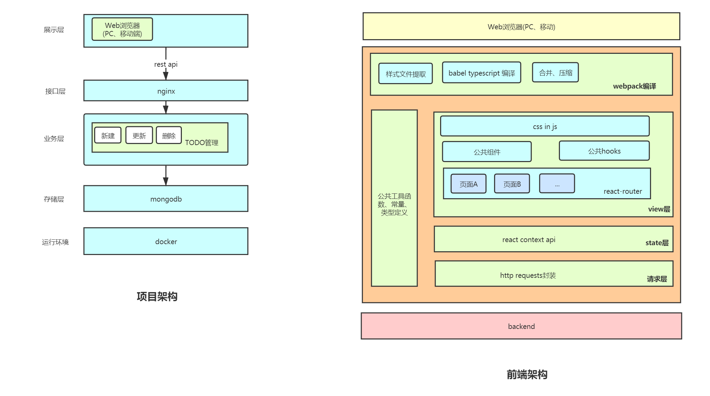

# 项目细节

### 背景
人们每天都有很多事情需要处理，若能使用一款软件来协助管理，这样可以极大提升办事效率。

### 目标
- 让用户不再将所有事情记到脑子里，解放大脑，让大脑产出率更高。  
- 极简的功能设计让使用者摆脱“设置纠结症”。

### 竞品分析
|名称| 是否免费可用| 是否有收费解锁新功能 (鸡肋) | 是否全平台支持|
|---|---|---|---| 
|[todolist](https://todoist.com/)| 是| 有| 是 |
|[microsoft todo](https://todo.microsoft.com/tasks/)| 是| 无| 是|
|[高效todo](http://www.gxtodo.com/)| 是| 有 | 否| 是 |

(注：全平台指Win、Mac、Android、IOS、Web)

#### todolist  
- 优：功能十分完整，提供了很多其他应用平台的聚合能力，在团队协作方面功能表现强大，里面的karma功能在用户完成todo后会积攒经验值，游戏化的方式来促进效率提升。
- 缺：该应用的免费版仅能使用到很基础的功能，付费版才是一个真正强大的TODO软件。不支持子任务功能。对国内安卓用户不太友好，国内主流安卓应用商店很难搜到其app，须使用google play。

#### microsoft todo 
- 优：功能十分完整，支持子任务，完全免费，界面设计十分清新，对个人或是小团体使用者相当合适。
- 缺：没有标签功能，在国内使用过程中网络有时不太稳定。

#### 高效todo 
- 优：采用四象限模式显示待办项，在时间优先级的表达上效果显著；含有项目功能，可以给每个项目创建待办项。
- 缺：界面虽然简洁明了，但整体来看样式风格还是偏旧，有提升空间。里面的地点功能对待办类软件作用不是很大。此外由于待办软件可能会在各自场景下使用到，不支持PC端也是一个较大的不足。

#### 本项目
在功能丰富度上与上述竞品相比明显不行，仅提供了TODO的增改删，但因为这单一的功能和轻简直观的界面，十分适合轻度场景下的使用，如短时间内的琐事记录，并且由于操作简单，任何年龄段人群都可迅速上手使用，且无需对待办项进行二次设置，随用随开，用完即关。

### 架构
该项目采用前后端分离的开发方式。前端在设计体验上以material风格为准，具体以react进行实现，使用自建的webpack模板进行开发环境的管理，在样式处理上统一采用css-in-js的方式。nginx负责静态资源服务和接口转发处理。后台使用nodejs搭建http服务器，在orm上选用了mongoose的变体@typegoose，其是对mongoose的封装，旨在提供更好的typescript开发体验。代码规范上使用了自封装的eslint插件确保规范和统一。选用docker托管服务，消除开发环境和部署环境的差异性。




### 里程碑 
#### 项目开发阶段（4-1截止）
1. 需求分析
1. 页面设计 
1. 页面代码实现 
1. 测试（不同浏览器）       
1. 部署

#### 后续维护阶段
##### v2 (4-20日截止)
1. 图片、语音支持
1. 唯一码形式的账户管理

##### v3 (5-1截止)
1. 更多屏幕分辨率的适配
1. 交互效果提升


### 项目目录结构
```txt
project
│ 
├── client #前端
│   ├── build
│   ├── src
│   │   ├── components #存放共享组件
│   │   │   ├── Todo.test.tsx #测试文件和对应组件放于同一目录
│   │   │   ├── Todo.tsx
│   │   │   ├── TodoInput.test.tsx
│   │   │   ├── TodoInput.tsx
│   │   │   ├── Todos.test.tsx
│   │   │   └── Todos.tsx
│   │   ├── pages #页面文件
│   │   │   └── index
│   │   │       └── Index.tsx
│   │   ├── App.tsx
│   │   ├── global.d.ts
│   │   ├── index.html
│   │   ├── index.tsx #打包入口文件
│   │   ├── modules.d.ts
│   │   └── requests.ts #http请求
│   ├── __mocks__
│   │   ├── fileMock.ts
│   │   └── styleMock.ts
│   ├── babel.config.json
│   ├── Dockerfile
│   ├── jest.config.js
│   ├── package.json
│   ├── prettier.config.js
│   ├── tsconfig.json
│   ├── webpack.config.js
│   └── webpack.dll.js
│ 
├── server #后端
│   ├── src
│   │   ├── controllers #存放存储层对业务层的接口暴露
│   │   │   └── todos.ts
│   │   ├── models #存放数据模型的定义
│   │   │   └── todo.ts
│   │   ├── routers #存放对接口层的请求处理
│   │   │   ├── helpers.ts
│   │   │   └── todos.ts
│   │   ├── App.ts #http server的初始化文件
│   │   ├── Db.ts #数据库的初始化文件
│   │   └── index.ts #项目入口文件
│   ├── Dockerfile
│   ├── install.sh
│   ├── package.json
│   ├── prettier.config.js
│   └── tsconfig.json
│ 
├── base.yml
├── dev.yml
├── prod.yml
└── README.md
```